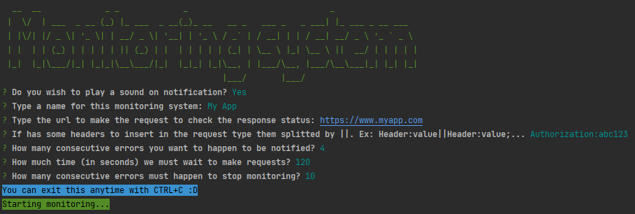

# Simple Monitoring Notify

This is an application to make simple monitoring in some URL, and be notified about it when it fails.

You can configure the notification name, URL to request, headers, and etc.

----

## How to use

In the folder `dist` you can find running applications, ready to use. Just copy the entire `dist` folder to your system and run the application for your system :D

It is compatible with `Windows`, `Linux` and `MacOS`.

If you want to change something, or customize it, you will need:

* `NodeJS >= 12`
* `PKG 5.3.3 (optional)`

#### If you are on Unix system: 

Just run `./build-pkg.sh` and copy the `dist` folder :D

#### Other systems:

After you make your changes, just run `npm install && npm run build:npx`, or if you have PKG installed run `npm install && npm run build:pkg`.  
If you want to use the Linux/MacOS binaries, remember to give execution privileges running `chmod +x dist/monitoring-notify-linux && chmod +x dist/monitoring-notify-macos`.    
When the process finished, it's ready to use!
